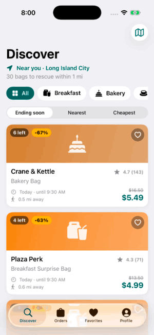
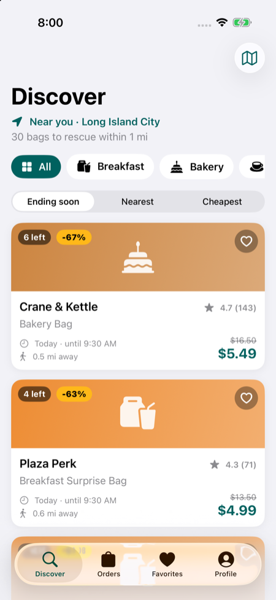
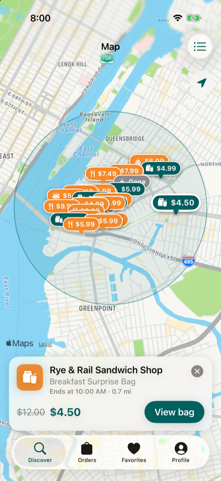
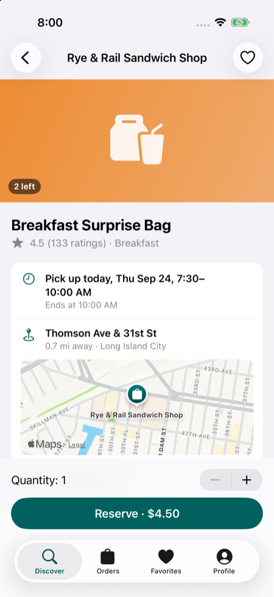
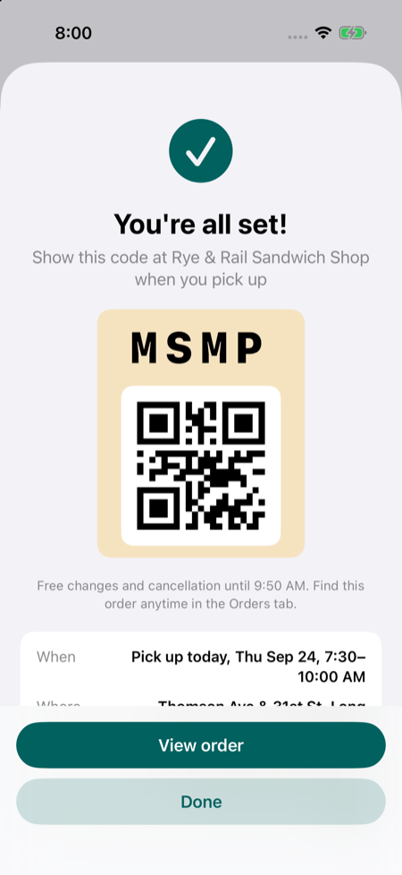
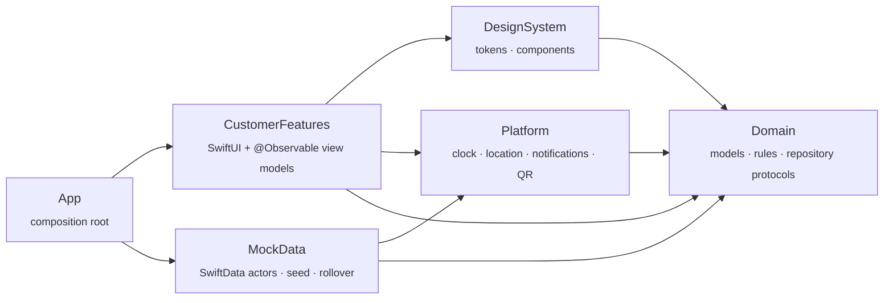

<div align="center">

# Walk & Take

**Rescue surplus food from local cafés and bakeries, from breakfast to dinner.**

An iOS 26 marketplace app, inspired by Too Good To Go, built with SwiftUI, SwiftData and Swift 6 strict concurrency.
Zero third-party dependencies.


&nbsp;


&nbsp;
&nbsp;
&nbsp;


</div>

## Highlights

- **Real marketplace logic, fully on device.** Reservations are atomic inside a SwiftData actor. In a test,
  20 simultaneous reserve attempts on a bag with 4 left produce exactly 4 orders, never more.
- **Time zones handled correctly.** Business time always runs on New York time through an injected clock.
  Offers roll over daily, tomorrow's bags appear at 8 PM, and everything stays correct across midnight and
  daylight-saving changes. A built-in time-travel tool makes it easy to demo.
- **Modular architecture.** Five Swift Package modules with enforced dependency rules. Feature screens only see
  Domain protocols, and the whole app is assembled in one place.
- **Swift 6 strict concurrency with zero warnings.** Actors, `Sendable` value types, and no
  `@unchecked Sendable`.
- **220 automated tests.** Swift Testing covers business rules, persistence, rollover and every view model,
  plus an XCUITest for the full reserve flow. Every feature flag has its own test.
- **Polished details.** Dynamic Type, VoiceOver, dark mode, QR pickup codes, local notifications, MapKit
  browsing, and a location fallback when permission is denied.

## Architecture



MVVM with one `@Observable` view model per screen. Views only render. Domain is pure Swift (Foundation only)
with no UI or persistence. See **[ARCHITECTURE.md](ARCHITECTURE.md)** for module rules, data flow, rollover and
flags.

| Area | Built with |
|---|---|
| UI | SwiftUI, MapKit, CoreImage (QR) |
| State | `@Observable` MVVM, `AsyncStream` change feeds |
| Persistence | SwiftData (two actors sharing one container) |
| Platform | CoreLocation (`CLLocationUpdate`, `CLServiceSession`), UserNotifications |
| Quality | Swift Testing, XCUITest, `swift-format` |

About 9k lines of app code and 3.5k lines of tests.

## Run it

1. Open `Walk_And_Take.xcodeproj` in Xcode 27.
2. Pick the **Walk_And_Take** scheme and an iOS 26 simulator.
3. Press ⌘R to run and ⌘U to test.

<details>
<summary><b>Debug tools & demo mode</b></summary>

In debug builds, **Profile → Developer** has:

- **Time travel**: jump to breakfast, lunch, 8:15 PM (tomorrow's bags open), 11:50 PM, or the next day, and
  back to live time.
- **Seed map**: all 21 seed restaurants with the 1.5 mi service area.

Launch arguments (the UI test uses these): `-UITestInMemoryStore`, `-UITestNow 2026-09-24T08:00:00-04:00`,
`-UITestFixedLocation`, `-UITestSkipSplash`.

Run the tests from the terminal:

```sh
xcodebuild test -project Walk_And_Take.xcodeproj -scheme Walk_And_Take \
  -destination 'platform=iOS Simulator,name=iPhone 17 Pro,OS=26.5'
```

</details>

## Team

Built by **Jian** and **Cheewai**. All restaurants and offers are fictional, set on real Long Island City
streets.
